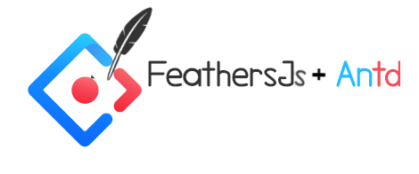

# Feathersjs-antd admin dashboard

<p align="center">
  
</p>

Admin panel blueprint using [ant design](https://ant.design/) and [feathersJs](https://docs.feathersjs.com/) client

## Get start

1. clone repo `https://github.com/abanobmossad/feathersjs-antd-admin-blueprint.git`
2. install dependencies
3. run server on port `3030`

```sh
npm install
```

3. start project

```sh
npm start
```

4. use components
